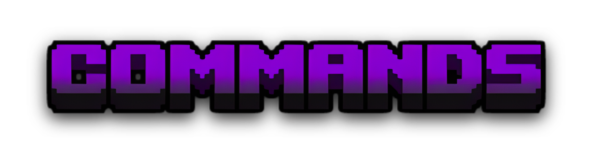
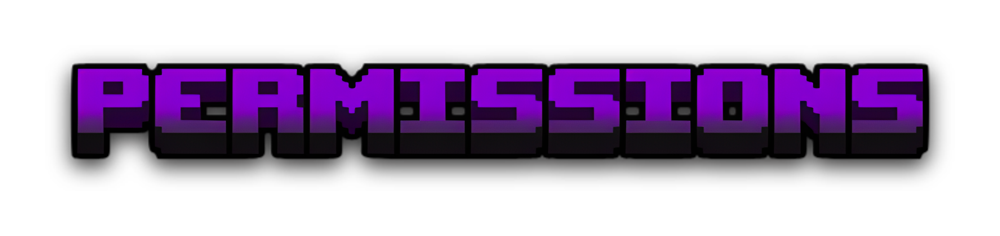

# MiniWalls is a minigame plugin with 8 players in 4 teams who have to fight each other and they are separated by some walls.

* ## 4 Teams
* ## Map destruction at deathmatch
* ## Commands to configure the config
* ## Light weight
* ## Auto reset of the map
* ## Walls
* ## Destructive bow
* ## Player Stats
* ## And more stuff

* ## /mw gui
* ## /mw help
* ## /mw join
* ## /mw leave
* ## /mw reload

## - mw.admin: Reload the config file, setup the config via commands